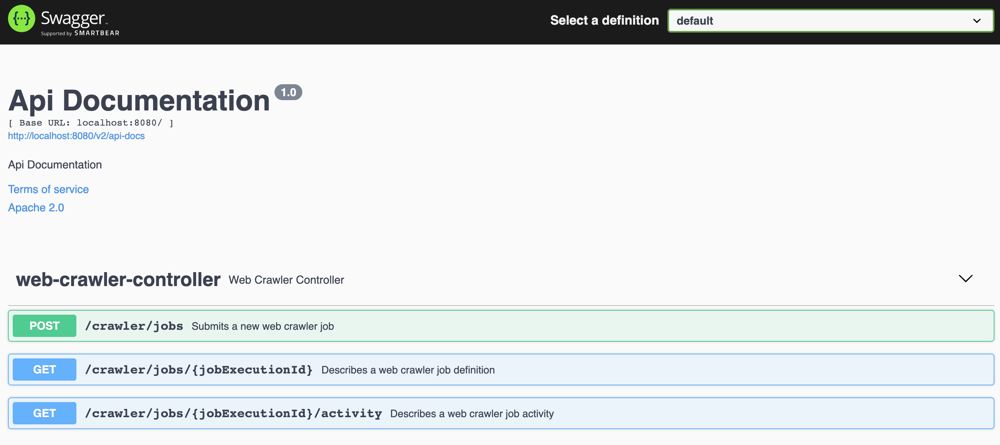

# webcrawler
A simple webcrawler written in java.
## How to run the application locally

### Setup
You will need `java11` and `docker`. `Gradle` is already distributed via Gradle Wrapper. The app depends on Redis but no particular setup is needed for that as Docker Compose takes care of it.

- ensure you are running java 11.
```
➜  webcrawler git:(master) ✗ java -version
openjdk version "11.0.3" 2019-04-16 LTS
OpenJDK Runtime Environment Zulu11.31+11-CA (build 11.0.3+7-LTS)
OpenJDK 64-Bit Server VM Zulu11.31+11-CA (build 11.0.3+7-LTS, mixed mode)
```
- build the fat jar (this will also run the test suite).
```
./gradlew clean build
```
- build the Docker image and run it through Docker Compose
```
docker-compose build
```

```
docker-compose up
```

### How to submit a request
The application is listening on port 8080 and exposes some APIs to perform webcrawler job operations.
You can navigate to http://localhost:8080/swagger-ui/ to take a look at the Swagger Docs.



An example request would look like this:
```shell script
➜  webcrawler git:(master) ✗ curl -v POST \
  http://localhost:8080/crawler/jobs \
  -H 'content-type: application/json' \
  -d '{
        "frontier": "https://monzo.com/",
        "politenessDelayMillis": 500,
        "maxDepthOfCrawling": 2
}'
* Rebuilt URL to: POST/
* Could not resolve host: POST
* Closing connection 0
curl: (6) Could not resolve host: POST
*   Trying ::1...
* TCP_NODELAY set
* Connected to localhost (::1) port 8080 (#1)
> POST /crawler/jobs HTTP/1.1
> Host: localhost:8080
> User-Agent: curl/7.54.0
> Accept: */*
> content-type: application/json
> Content-Length: 94
>
* upload completely sent off: 94 out of 94 bytes
< HTTP/1.1 201
< Location: http://localhost:8080/crawler/jobs/71d0171f-720b-4cea-8dfc-9952e888da48
< Content-Length: 0
< Date: Mon, 12 Oct 2020 14:30:49 GMT
<
* Connection #1 to host localhost left intact
```
Note that `maxDepthOfCrawling` and `politenessDelayMillis` are optional parameters.